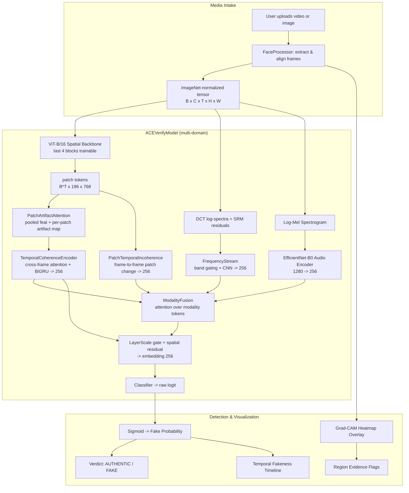

<div align="center">
  <h1>ACE.verify</h1>

  <p align="center">
    
    
    
    <a href="https://github.com/AB-at-UCR/ACE.verify/actions/workflows/docker-build.yml"></a>
  </p>

  <p align="center">A multimodal deepfake detection platform that analyzes facial video and audio signals, generates Grad-CAM explainability overlays, and delivers real-time verdicts through an interactive web application.</p>
</div>

<div align="center">
  
</div>
<br>
<p align="center"> Deployed app can be accessed at : https://abhar061-ace-verify.hf.space </p>

---

## Key Features

- **Multimodal Deepfake Detection** &mdash; Combines a Vision Transformer (ViT-B/16) video backbone with a temporal GRU (Gated Recurrent Unit) and an EfficientNet-B0 audio spectrogram encoder to classify media as authentic or manipulated.
- **Grad-CAM Explainability** &mdash; Generates attention heatmaps overlaid on input frames to reveal exactly which facial regions drive the model's prediction.
- **Temporal Fakeness Timeline** &mdash; Renders a per-frame fakeness score bar chart so analysts can scrub through the video and pinpoint when manipulation occurs.
- **Region-Based Evidence Scoring** &mdash; Decomposes Grad-CAM into facial regions (Periocular, Mouth, Forehead, Chin) and derives interpretable evidence flags (eye-blink anomaly, lip-sync mismatch, texture inconsistency, etc.).
- **Model Switching** &mdash; Select between EfficientNet-B4 (Fast), XceptionNet (Accurate), and ACE.verify (Best) at inference time without retraining.
- **Interactive Web UI** &mdash; A Streamlit application with a responsive two-column layout, custom CSS design system, media preview, confidence gauge, evidence chips, metadata table, and a frame inspector with a temporal scrubber.
- **Example Media Library** &mdash; Ships with five preset deepfake samples (FaceSwap clip, Lip-sync fake, GAN portrait, Unauthentic news, Political speech) for immediate testing.

---

## Tech Stack

| Category | Technology | Details |
|---|---|---|
| **Frontend** | Streamlit | Python web framework, custom CSS design system |
| | CSS3 | Custom theme variables, flexbox layout, responsive breakpoints |
| **Backend** | Python 3.10&ndash;3.12 | Application logic, CLI entrypoints |
| | Streamlit Server | Port 8501, static file serving enabled |
| **ML/CV Models** | PyTorch 2.5.1 | Core tensor operations, model training |
| | timm | ViT-B/16, EfficientNet-B0/B4, XceptionNet backbones |
| | torchvision | Image transforms, data augmentation |
| | torchaudio | Mel-spectrogram computation |
| | MediaPipe | Face landmark detection & alignment |
| | facenet-pytorch (MTCNN) | Face detection during preprocessing |
| | Hugging Face Transformers | TimeSformer baseline benchmarking |
| **Infrastructure** | Docker (CUDA 12.4) | `pytorch/pytorch:2.5.1-cuda12.4-cudnn9-runtime` base |
| | Kubernetes / NRP | GPU job templates, PVC storage |
| | GitHub Actions | CI/CD pipeline for Docker image build & push |
| | Conda | Environment management (`conda_env.yml`, `conda_env_new.yml`) |

---

## Architecture Overview



The pipeline flows from media upload through face alignment, multi-domain feature extraction (spatial, frequency, motion, audio), attention fusion, and binary classification. The auxiliary streams are added to the spatial feature through a LayerScale gate rather than replacing it, so the pretrained backbone always keeps a direct path to the classifier. Grad-CAM overlays, the per-patch artifact map, and temporal scoring provide explainability alongside the final verdict.

Pass `--model baseline` to any entry point to run the pre-enhancement architecture (ViT-B/16 + BiGRU + gated concat fusion) for comparison.

> For a comprehensive deep-dive into the ML pipeline, model architecture, and data flow, consult the **[GitHub Wiki](../../wiki)**.

---

## Quickstart Guide

### Prerequisites

- **Python** 3.10 or newer (up to 3.12)
- **CUDA** 12.4 or compatible (optional; CPU works for inference)
- **GPU** with at least 16&nbsp;GiB VRAM for training
- **ffmpeg** installed and available on your `PATH`

### Local Installation

**Option 1: Conda (recommended)**

```bash
conda env create -f conda_env_new.yml
conda activate aceverify
pip install -e .
```

**Option 2: Virtual environment**

```bash
python -m venv .venv
source .venv/bin/activate
pip install -e .
```

The `pip install -e .` command reads `aceverify/pyproject.toml` and installs all dependencies along with the following CLI entrypoints:

| Command | Description |
|---|---|
| `aceverify-preprocess` | Convert DFDC-style zip archives into HDF5 files |
| `aceverify-train` | Train the ACEVerifyModel on processed HDF5 data |
| `aceverify-evaluate` | Evaluate a trained checkpoint on test data |

### Environment Variables

| Variable | Purpose | Default |
|---|---|---|
| `PYTHONPATH` | Module resolution inside Docker container | `/workspace` (set in Dockerfile) |
| `FFMPEG_BIN` | Override path to ffmpeg executable | Resolved from `PATH` |
| `CUDA_VISIBLE_DEVICES` | Restrict GPU visibility | All GPUs |

### Running the Web App

```bash
streamlit run frontend/app.py
```

The app starts on `http://localhost:8501`. Static file serving is configured in `.streamlit/config.toml` to deliver preset videos and user uploads at the `app/static/...` path.

### Training

```bash
aceverify-train \
  --train_path data/train_data-003.h5 \
  --test_path data/test_data.h5 \
  --checkpoint-path results/aceverify_final.pth \
  --epochs 10 \
  --batch-size 8
```

Default hyperparameters (from `aceverify/train.py`):

- Learning rate: `5e-5`
- Optimizer: `AdamW` (weight_decay `1e-4`)
- Loss: `BCEWithLogitsLoss` (pos_weight `2.0`)
- Scheduler: `StepLR` (step_size `2`, gamma `0.5`)

### Evaluation

```bash
aceverify-evaluate \
  --h5 data/test_data.h5 \
  --checkpoint results/aceverify_final.pth \
  --batch-size 8
```

### Preprocessing

```bash
aceverify-preprocess dfdc_train_part_00.zip dfdc_train_part_0 --output data/processed_data.h5
```

Useful options:

- `--temp-dir` &mdash; override the temporary extraction directory
- `--ffmpeg-bin` &mdash; point to a specific `ffmpeg` executable
- `--log-level` &mdash; set preprocessing verbosity (`DEBUG`, `INFO`, `WARNING`, `ERROR`, `CRITICAL`)

---

## Repository Structure

```
ACE.verify/
├── .github/workflows/         # CI/CD: Docker image build & push
│   └── docker-build.yml
├── .streamlit/                # Streamlit server configuration
│   └── config.toml            # enableStaticServing = true
├── aceverify/                 # Core training package (pip-installable)
│   ├── __init__.py            # Package exports
│   ├── pyproject.toml         # Package metadata, dependencies, CLI scripts
│   ├── model.py               # ACEVerifyModel: ViT-B/16 + GRU + audio fusion
│   ├── train.py               # Training loop, checkpointing, CLI entrypoint
│   ├── dataset.py             # ACEDataset: HDF5-backed video+audio dataset
│   ├── preprocess.py          # DFDC zip -> HDF5 preprocessing pipeline
│   └── visualize_data.py      # Dataset sample visualization helper
├── app/                       # Legacy Streamlit app (older API version)
│   ├── streamlit_app.py
│   └── services.py
├── evaluation/                # Model evaluation & benchmarking
│   ├── __init__.py
│   ├── evaluate.py            # Standalone evaluation script
│   ├── aceverify_test.py      # ACE.verify model benchmark
│   ├── spatial2D_test.py      # Spatial (2D) baseline benchmarks (Xception, EffNet)
│   └── timeSformer_test.py    # TimeSformer baseline benchmark
├── frontend/                  # Production web application
│   ├── __init__.py
│   ├── app.py                 # Main Streamlit app (533 lines)
│   ├── app.css                # Custom CSS design system (392 lines)
│   └── static/                # Preset media & runtime upload storage
│       ├── *.mp4              # Example deepfake videos
│       ├── face-swap.png      # Example deepfake image
│       └── uploads/           # User upload destination (gitignored)
├── models/                    # Alternative model wrappers for the webapp
│   ├── __init__.py            # Exports ACEVerifyIntegration, DeepfakeEfficientNet, DeepfakeXception
│   ├── ace_verify.py          # ACEVerify integration model (TorchScript)
│   ├── efficientnet.py        # DeepfakeEfficientNet (timm tf_efficientnet_b4)
│   ├── xception.py            # DeepfakeXception (timm xception)
│   └── face_landmarker.task   # MediaPipe Face Landmarker model file
├── src/                       # Standalone attention map utilities
│   └── attention_map.py       # ViT attention visualization & video prediction
├── utilities/                 # Shared helper modules
│   ├── __init__.py            # Package exports
│   ├── gradcam.py             # Grad-CAM heatmap generation & region scoring
│   ├── media_preview.py       # Media preview rendering for upload card
│   ├── static_media.py        # Static file serving, upload handling, MIME patching
│   ├── preprocess.py          # FaceProcessor: alignment, frame extraction, metadata
│   ├── model.py               # Model loading utilities for the webapp
│   └── timeline.py            # Temporal fakeness timeline rendering
├── assets/templates/          # Kubernetes / NRP deployment manifests
│   ├── nrp-pvc.yaml           # PersistentVolumeClaim (200Gi, rook-ceph-block)
│   ├── nrp-gpu-job.yaml       # GPU training Job (RTX-A6000 node selector)
│   └── nrp-sweep-job.yaml     # Hyperparameter sweep Job (4 parallel)
├── scripts/                   # Deployment helpers & experiment notebooks
│   ├── copy-to-pvc.sh         # Copy local files into a PVC
│   ├── copy-from-pvc.sh       # Copy files out of a PVC
│   └── *.ipynb                # Experiment & ablation notebooks
├── results/                   # Generated experiment artifacts (PDFs, images)
├── Dockerfile                 # CUDA 12.4 container image
├── conda_env.yml              # Conda env (Python 3.13, minimal)
├── conda_env_new.yml          # Conda env (Python 3.11, full ML stack)
├── .dockerignore              # Docker build exclusions
├── .gitignore                 # Git exclusions
├── README.md                  # This file
└── README_NRP.md              # NRP / Nautilus deployment guide
```

> For a detailed file-by-file breakdown, see the **[GitHub Wiki](../../wiki)**.

---

## Contributing

1. Fork the repository and create a feature branch (`git checkout -b feature/amazing-feature`).
2. Ensure code passes existing tests and linting.
3. Write clear commit messages following conventional commits.
4. Open a Pull Request against the `main` branch.

---
