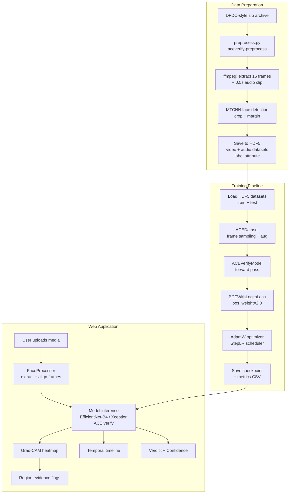
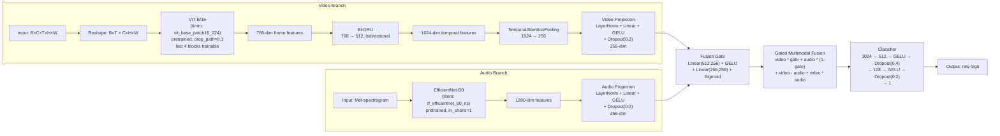
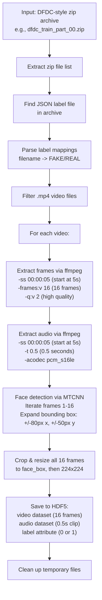
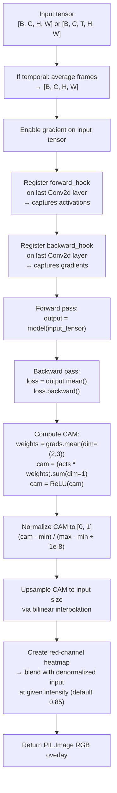

# Architecture and Pipeline

> :material-sitemap: Deep dive into the ACE.verify multimodal deepfake detection architecture, the ML/video processing pipeline, frame extraction mechanics, model selection, Grad-CAM overlay generation, and confidence scoring.

---

## System Overview



The system operates across three stages:

1. **Data Preparation** &mdash; Raw DFDC-style video archives are converted into HDF5 datasets with aligned face crops and audio spectrograms.
2. **Training** &mdash; The `ACEVerifyModel` is trained on processed HDF5 data using a weighted binary cross-entropy loss with AdamW optimization.
3. **Inference & Visualization** &mdash; The Streamlit web application handles media uploads, runs model inference, generates Grad-CAM explainability overlays, and renders temporal fakeness timelines.

---

## Model Architecture: ACEVerifyModel

> **Source**: `aceverify/model.py`

The `ACEVerifyModel` is a multimodal architecture that fuses video frame features with audio spectrogram features through a gated mechanism, then classifies the fused representation as authentic (`0`) or fake (`1`).

### Architecture Diagram



### Component Details

#### TemporalAttentionPooling (`model.py:7`)

Reduces the sequence of per-frame features into a single fixed-length representation via learned attention weights:

```python linenums="1" title="aceverify/model.py"
class TemporalAttentionPooling(nn.Module):
    def __init__(self, input_dim: int, hidden_dim: int = 256):
        self.attention = nn.Sequential(
            nn.Linear(input_dim, hidden_dim),   # (1)
            nn.Tanh(),                           # (2)
            nn.Linear(hidden_dim, 1),            # (3)
        )

    def forward(self, sequence):  # [B, T, input_dim]
        attention_logits = self.attention(sequence)
        attention_weights = torch.softmax(attention_logits, dim=1)  # (4)
        return torch.sum(sequence * attention_weights, dim=1)       # (5)
```

1. :material-arrow-right: Project each timestep's features to a hidden representation.
2. :material-arrow-right: Apply `Tanh` non-linearity to bound the logits.
3. :material-arrow-right: Produce a single scalar attention score per timestep.
4. :material-arrow-right: `Softmax` over the temporal dimension converts scores to probabilities.
5. :material-arrow-right: Element-wise multiply + sum yields the attention-pooled vector.

**Input**: Sequence tensor of shape `[B, T, input_dim]` (default `input_dim=1024` from the bidirectional GRU output).

**Output**: Pooled tensor of shape `[B, input_dim]`.

#### SpectrogramEncoder (`model.py:22`)

Encodes Mel-spectrograms into a 256-dimensional audio feature vector:

```python linenums="1" title="aceverify/model.py"
class SpectrogramEncoder(nn.Module):
    def __init__(self, feature_dim: int = 1280):
        self.backbone = timm.create_model(
            "tf_efficientnet_b0_ns",   # EfficientNet-B0 (Noisy Student)
            pretrained=True,
            in_chans=1,                # Single-channel spectrogram input
            num_classes=0,             # Feature extractor only (1)
        )
        self.projection = nn.Sequential(
            nn.LayerNorm(feature_dim),  # 1280
            nn.Linear(feature_dim, 256),
            nn.GELU(),
            nn.Dropout(0.2),
        )
```

1. :material-arrow-right: `num_classes=0` strips the classification head, returning the 1280-dim pooled feature.

#### ACEVerifyModel Forward Pass (`model.py:87`)

The forward pass orchestrates video feature extraction, audio encoding, gated fusion, and classification:

1. **Video Reshape**: Input `[B, C, T, H, W]` is permuted and reshaped to `[B*T, C, H, W]` so each frame is processed individually by the ViT backbone.
2. **ViT Feature Extraction**: Produces 768-dim features per frame, reshaped back to `[B, T, 768]`.
3. **Temporal Modeling**: A bidirectional GRU ($768 \rightarrow 512$) processes the sequence, outputting 1024-dim features per timestep.
4. **Temporal Pooling**: `TemporalAttentionPooling` reduces `[B, T, 1024]` to `[B, 1024]`, then projected to 256-dim via the video projection layer.
5. **Audio Encoding**: If no audio is provided, a zero spectrogram is used. The audio tensor is normalized in shape and passed through the `SpectrogramEncoder`.
6. **Gated Fusion**: The fusion gate computes a sigmoid-weighted gate value $g \in [0,1]$. The fused representation combines:
   - $\mathbf{v} \cdot g$ &mdash; gated video features
   - $\mathbf{a} \cdot (1 - g)$ &mdash; gated audio features
   - $\mathbf{v} - \mathbf{a}$ &mdash; video-audio difference
   - $\mathbf{v} \odot \mathbf{a}$ &mdash; video-audio Hadamard product

   These four 256-dim vectors are concatenated to form a 1024-dim fused feature.

7. **Classification**: The 3-layer classifier MLP maps the 1024-dim fused features to a single raw logit.

The fusion gate value can be expressed as:

$$
g = \sigma\!\Big(W_2 \cdot \text{GELU}(W_1 \, [\mathbf{v}; \mathbf{a}])\Big)
$$

where $W_1 \in \mathbb{R}^{256 \times 512}$ and $W_2 \in \mathbb{R}^{256 \times 256}$.

#### Transfer Learning Strategy

The ViT-B/16 backbone uses a selective freezing strategy:

```python linenums="1" title="aceverify/model.py"
for param in self.video_model.parameters():
    param.requires_grad = False         # Freeze all ViT layers (1)
for param in self.video_model.blocks[-4:].parameters():
    param.requires_grad = True          # Unfreeze last 4 blocks (2)
```

1. :material-snowflake: All pre-trained ViT parameters are frozen to preserve low-level feature representations.
2. :material-fire: Only the last 4 transformer blocks are unfrozen, allowing the model to adapt high-level features for deepfake detection while retaining the pre-trained initialization.

---

## Dataset & Data Pipeline

> **Source**: `aceverify/dataset.py`

### ACEDataset Class

The `ACEDataset` class (`torch.utils.data.Dataset`) provides on-demand access to video frames and audio spectrograms stored in HDF5 files.

| Parameter | Type | Default | Description |
|---|---|---|---|
| `h5_path` | `str` | *required* | Path to the HDF5 file |
| `indices` | `list[int] \| None` | `None` | Sample indices to include; `None` loads all |
| `is_training` | `bool` | `False` | If `True`, applies data augmentation |

### Data Loading & Sampling (`dataset.py:25`)

Each `__getitem__` call performs the following:

1. **Open HDF5 file lazily**: The file handle is kept open for the lifetime of the dataset object and closed on deletion.
2. **Frame subsampling**: From the full video tensor (shape `[total_frames, H, W, C]`), 16 frames are sampled with a stride of 2. If the video has fewer frames than needed, linear interpolation is used instead:
   ```python
   indices = np.arange(0, num_output_frames * stride, stride)
   if indices[-1] >= total_frames:
       indices = np.linspace(0, total_frames - 1, num_output_frames).astype(int)
   ```
3. **Tensor conversion**: Selected frames are converted to a float tensor with shape `[C, T, H, W]` (channels-first, temporal dimension) and normalized to $[0, 1]$ range.
4. **Data augmentation** (training only):
   - `ColorJitter(brightness=0.2, contrast=0.2)` &mdash; Random brightness/contrast adjustment.
   - `RandomErasing(p=0.5, scale=(0.02, 0.1), ratio=(0.3, 3.3), value=0)` &mdash; Occlusion augmentation to improve robustness.
5. **Audio spectrogram**: The raw audio is loaded, downmixed to mono if multi-channel, and transformed via `MelSpectrogram`:
   ```python
   spectrogram_transform = MelSpectrogram(
       sample_rate=44100,
       n_mels=32,
       n_fft=400,
       hop_length=160,
   )
   ```
   The resulting spectrogram is interpolated to $(224, 224)$ via bilinear interpolation.
6. **Label**: The `label` attribute from the HDF5 group is converted to a `torch.long` tensor. Labels are `0` (Real) or `1` (Fake).

### HDF5 Storage Format

Each HDF5 file contains multiple top-level groups, one per video sample:

```
/
├── {video_basename}/
│   ├── video          # numpy.ndarray [16, 224, 224, 3] uint8, gzip-compressed
│   ├── audio          # numpy.ndarray [N] float32, gzip-compressed (raw audio samples)
│   └── (attrs)
│       └── label      # int: 0 (Real) or 1 (Fake)
├── {next_video}/
│   └── ...
```

---

## Preprocessing Pipeline

> **Source**: `aceverify/preprocess.py`

The preprocessing pipeline converts DFDC-style zip archives into HDF5 datasets suitable for training and evaluation.

### Pipeline Flow (`preprocess.py:166`)



### FFmpeg Frame Extraction (`preprocess.py:51`)

FFmpeg extracts 16 frames per video starting at 5 seconds into the clip:

```bash
ffmpeg -loglevel error -ss 00:00:05 -i input.mp4 -frames:v 16 -q:v 2 frame_%02d.jpg
```

| Flag | Purpose |
|---|---|
| `-ss 00:00:05` | Seek to 5 seconds into the video |
| `-frames:v 16` | Extract exactly 16 video frames |
| `-q:v 2` | JPEG quality factor (2 = high quality) |

### FFmpeg Audio Extraction (`preprocess.py:58`)

```bash
ffmpeg -loglevel error -ss 00:00:05 -i input.mp4 -vn -t 0.5 -acodec pcm_s16le audio.wav
```

| Flag | Purpose |
|---|---|
| `-vn` | Skip video output |
| `-t 0.5` | Extract 0.5 seconds of audio |
| `-acodec pcm_s16le` | Uncompressed PCM 16-bit signed little-endian |

### MTCNN Face Detection (`preprocess.py:69`)

The pipeline uses `MTCNN` from `facenet-pytorch` with `keep_all=False` to detect a single face per frame. It iterates through frames 1 to 16 until a face is detected, then applies the bounding box to all frames:

```python linenums="1" title="aceverify/preprocess.py"
mtcnn = MTCNN(keep_all=False, device=device)
for i in range(1, 17):
    face_boxes, _ = mtcnn.detect(frame)
    if face_boxes is not None:
        face_box = face_boxes[0].astype(int)
        face_box[0] -= 80   # x1 (left margin)
        face_box[1] -= 50   # y1 (top margin)
        face_box[2] += 80   # x2 (right margin)
        face_box[3] += 50   # y2 (bottom margin)
        break
```

The bounding box is expanded by 80px horizontally and 50px vertically to capture surrounding facial context.

### Label Mapping (`preprocess.py:203`)

```python
if label_string == 'FAKE':
    label = 1
else:
    label = 0
```

The DFDC JSON metadata file maps video filenames to `"FAKE"` or `"REAL"` string labels. These are converted to integer labels (`1` = Fake, `0` = Real) and stored as HDF5 group attributes.

---

## Training Pipeline

> **Source**: `aceverify/train.py`

### Training Configuration

| Hyperparameter | Value | Source |
|---|---|---|
| Learning rate | $5 \times 10^{-5}$ | `train.py:240` |
| Optimizer | `AdamW` (weight_decay $1 \times 10^{-4}$) | `train.py:252` |
| Loss function | `BCEWithLogitsLoss` (pos_weight $= 2.0$) | `train.py:251` |
| Scheduler | `StepLR` (step_size $= 2$, $\gamma = 0.5$) | `train.py:253` |
| Default epochs | `10` | `train.py:222` |
| Default batch size | `8` | `train.py:223` |
| Device | `cuda` if available, else `cpu` | `train.py:239` |

The loss function is the Binary Cross-Entropy with Logits, weighted to address class imbalance:

$$
\mathcal{L} = -\frac{1}{N}\sum_{i=1}^{N}\Big[w \cdot y_i \log\sigma(z_i) + (1-y_i)\log(1-\sigma(z_i))\Big]
$$

where $w = 2.0$ is the positive class weight, $z_i$ is the raw logit, and $\sigma$ is the sigmoid function.

### Training Loop (`train.py:69`)

The `train_model()` function orchestrates the full training loop:

1. **Checkpoint Resume**: Attempts to load an existing checkpoint from `checkpoint_path`. Supports both `state_dict` and dict-wrapped (`{'model_state_dict': ...}`) formats. On `FileNotFoundError`, training continues from the pretrained ViT weights.
2. **Per-Epoch Training**:
   - Rebuilds the training dataset each epoch (random balanced sampling of real/fake samples).
   - Forward pass: `outputs = model(videos, specs)`.
   - Loss: `loss = criterion(outputs, labels)`.
   - Backward pass + optimizer step with gradient zeroing.
   - Predictions: `(torch.sigmoid(outputs) > 0.5).float()`.
   - Training accuracy logged every 10 steps.
3. **Per-Epoch Validation**:
   - Runs on a held-out test dataset (200 samples, balanced).
   - Collects predictions and ground-truth labels.
   - Validation accuracy computed and logged.
4. **Metrics & Checkpointing**:
   - After all epochs, generates a `classification_report` via `sklearn.metrics`.
   - Saves the final model state dict to `checkpoint_path`.
   - Exports per-epoch metrics (train accuracy, test accuracy) to CSV at `checkpoint_path.replace('.pth', '_metrics.csv')`.

### Data Sampling for Training (`train.py:27`)

The `load_data()` function handles balanced sampling of real and fake samples:

1. If no indices are provided, reads all label attributes from the HDF5 file.
2. Identifies real (`label=0`) and fake (`label=1`) sample indices.
3. Randomly selects $n // 2$ samples from each class (balanced).
4. Shuffles the combined indices.
5. Returns an `ACEDataset` instance with the selected indices.

### CLI Arguments (`train.py:217`)

| Argument | Type | Required | Default | Description |
|---|---|---|---|---|
| `--train_path` | `str` | Yes | &mdash; | Path to the training HDF5 file |
| `--test_path` | `str` | Yes | &mdash; | Path to the test HDF5 file |
| `--checkpoint-path` | `str` | No | `results/aceverify_final.pth` | Where to save the checkpoint |
| `--epochs` | `int` | No | `10` | Number of training epochs |
| `--batch-size` | `int` | No | `8` | Training and validation batch size |
| `--log-level` | `str` | No | `INFO` | Logging verbosity |

---

## Frame Extraction Mechanics

> **Sources**: `aceverify/preprocess.py`, `utilities/preprocess.py`, `app/services.py`

There are three frame extraction implementations across the codebase, each tailored to a specific runtime context.

=== "Preprocessing Pipeline"

    Used by the `aceverify-preprocess` CLI entrypoint. Extracts frames and audio directly via `ffmpeg` subprocess:

    ```bash
    # Frame extraction (16 frames at 5s offset)
    ffmpeg -loglevel error -ss 00:00:05 -i input.mp4 -frames:v 16 -q:v 2 output_%02d.jpg

    # Audio extraction (0.5s clip at 5s offset)
    ffmpeg -loglevel error -ss 00:00:05 -i input.mp4 -vn -t 0.5 -acodec pcm_s16le output.wav
    ```

    Face detection uses **MTCNN** (`facenet-pytorch`) with `keep_all=False` for single-face detection.

=== "Web App FaceProcessor"

    Used by the Streamlit web application. The `FaceProcessor` class uses **MediaPipe Face Landmarker** for alignment:

    ```python linenums="1" title="utilities/preprocess.py"
    class FaceProcessor:
        def __init__(self, target_size=(224, 224)):
            self.face_landmarker = self.init_face_landmarker(self.root_dir)
            self.transform = transforms.Compose([
                transforms.ToTensor(),
                transforms.Normalize(
                    mean=[0.485, 0.456, 0.406],
                    std=[0.229, 0.224, 0.225],
                ),
            ])
    ```

    - `extract_image()`: Reads an image, converts BGR to RGB, aligns the face via landmark-based affine transformation, and applies ImageNet normalization.
    - `extract_frames()`: Uses `cv2.VideoCapture` to decode video frames, converts each to RGB, resizes to 224×224, and aligns the face.
    - `get_alignment_matrix()`: Computes an affine transformation matrix that rotates and scales the image to align eye corners (landmarks 33 and 263) to canonical positions at $(0.35, 0.4)$ and $(0.65, 0.4)$.

=== "Legacy App Services"

    Used by the older `app/streamlit_app.py`. Similar to the preprocessing pipeline but stores intermediate results in a temporary directory:

    ```python
    # Extract 16 frames
    subprocess.run(['ffmpeg', '-ss', '00:00:05', '-i', f'{path}.mp4',
                    '-frames:v', '16', '-q:v', '2', f'{path}_%02d.jpg'])

    # Extract 0.5s audio
    subprocess.run(['ffmpeg', '-ss', '00:00:05', '-i', f'{path}.mp4',
                    '-vn', '-t', '0.5', '-acodec', 'pcm_s16le', f'{path}_audio.wav'])

    # MTCNN face detection + crop to 224x224
    mtcnn = MTCNN(keep_all=False)
    face_box = mtcnn.detect(frame)[0][0].astype(int)
    image.crop(face_box).resize((224, 224))
    ```

### Frame Sampling Strategy

The `ACEDataset.__getitem__` method (`dataset.py:25`) implements a stride-based frame sampling:

```python linenums="1" title="aceverify/dataset.py"
num_output_frames = 16
stride = 2
indices = np.arange(0, num_output_frames * stride, stride)
# indices = [0, 2, 4, 6, 8, 10, 12, 14, 16, 18, 20, 22, 24, 26, 28, 30]

if indices[-1] >= total_frames:
    # Fall back to evenly-spaced sampling
    indices = np.linspace(0, total_frames - 1, num_output_frames).astype(int)
```

This selects every 2nd frame from the first 32 frames of the processed clip, providing temporal coverage while maintaining consistency across samples.

---

## Grad-CAM Overlay Generation

> **Sources**: `utilities/gradcam.py`, `src/attention_map.py`

### Grad-CAM Algorithm (`utilities/gradcam.py:7`)

The `generate_gradcam()` function implements the Gradient-weighted Class Activation Mapping algorithm:



The core CAM computation uses gradient-weighted activations from the last convolutional layer:

$$
\text{CAM}(x, y) = \text{ReLU}\!\left(\sum_{k=1}^{C} \alpha_k \cdot A_k(x, y)\right)
$$

where $A_k$ is the $k$-th feature map activation and $\alpha_k$ is the global average pooled gradient:

$$
\alpha_k = \frac{1}{Z} \sum_{x=1}^{H'} \sum_{y=1}^{W'} \frac{\partial y^c}{\partial A_k(x, y)}
$$

### Implementation Details

1. **Layer Selection**: The function searches the model hierarchy for the last `Conv2d` layer:
   ```python
   for module in target.modules():
       if isinstance(module, torch.nn.Conv2d):
           last_conv = module
   ```

2. **Gradient Weighting**: Activations from the forward hook are weighted by the global-average-pooled gradients from the backward hook:
   ```python
   weights = grads.mean(dim=(2, 3), keepdim=True)  # [B, C_feat, 1, 1]
   cam = (acts * weights).sum(dim=1, keepdim=True)  # [B, 1, H_feat, W_feat]
   cam = F.relu(cam)
   ```

3. **Normalization**: The CAM is min-max normalized to $[0, 1]$:
   ```python
   cam = (cam - cam.amin(dim=(2, 3), keepdim=True)) / \
         (cam.amax(dim=(2, 3), keepdim=True) - cam.amin(dim=(2, 3), keepdim=True) + 1e-8)
   ```

4. **Upsampling**: The CAM is upsampled from feature-map resolution to input resolution:
   ```python
   cam = F.interpolate(cam, size=(h, w), mode='bilinear', align_corners=False)
   ```

5. **Heatmap Blending**: The normalized CAM is converted to a red-channel heatmap and blended with the denormalized input image at the given intensity:
   ```python
   heatmap_rgb = np.zeros((h, w, 3), dtype=np.uint8)
   heatmap_rgb[:, :, 0] = (cam * 255).astype(np.uint8)  # Red channel
   result = (1 - alpha) * img_np.astype(np.float32) + alpha * heatmap_rgb.astype(np.float32)
   ```

### ViT Attention-Based Visualization (`src/attention_map.py`)

The `attention_map()` and `visualize_all_frames()` functions provide an alternative visualization based on ViT attention weights rather than gradient-weighted activations:

```python linenums="1" title="src/attention_map.py"
target_layer = model.video_model.blocks[-1].attn.qkv
handle = target_layer.register_forward_hook(hook_fn)

# Forward pass
_ = model.video_model(input_video)

# Extract Q, K, V from the QKV fused projection
qkv = qkv_out.reshape(B, N, 3, num_heads, head_dim).permute(2, 0, 3, 1, 4)
q, k = qkv[0], qkv[1]

# Compute attention weights
attn = (q @ k.transpose(-2, -1)) * (head_dim ** -0.5)
attn = attn.softmax(dim=-1).mean(dim=1)

# Extract CLS token attention (patch tokens, excluding CLS itself)
cls_attn = attn[:, 0, 1:]
mask = cls_attn[frame_idx].reshape(14, 14)
```

!!! note "Key differences from Grad-CAM"
    - Uses the ViT's native self-attention weights instead of gradient-weighted activations.
    - Focuses on the CLS token's attention to patch tokens.
    - The attention map is reshaped to a 14×14 grid (ViT-B/16 with 224×224 input produces 14×14 patches).
    - Applied with `cv2.applyColorMap` using `cv2.COLORMAP_JET` and a blend factor of 0.4 (heatmap) + 0.6 (original frame).

---

## Region-Based Evidence Scoring

> **Source**: `utilities/gradcam.py:154`

### Region Score Extraction

The `region_scores_from_heatmap()` function decomposes a Grad-CAM heatmap into facial regions by averaging pixel intensities within predefined bounding boxes:

```python linenums="1" title="utilities/gradcam.py"
def region_scores_from_heatmap(heatmap_img):
    arr = np.array(heatmap_img.convert("RGB"))[:, :, 0].astype(np.float32) / 255.0
    h, w = arr.shape
    periocular = arr[int(0.15*h):int(0.45*h), int(0.2*w):int(0.8*w)].mean()
    mouth      = arr[int(0.55*h):int(0.9*h),  int(0.25*w):int(0.75*w)].mean()
    forehead   = arr[int(0.0*h):int(0.2*h),   int(0.2*w):int(0.8*w)].mean()
    chin       = arr[int(0.82*h):int(1.0*h),  int(0.25*w):int(0.75*w)].mean()
    return [
        ("Periocular", float(periocular)),
        ("Mouth",      float(mouth)),
        ("Forehead",   float(forehead)),
        ("Chin",       float(chin)),
    ]
```

| Region | Y range | X range | Approx. facial area |
|---|---|---|---|
| Periocular | 15% &ndash; 45% | 20% &ndash; 80% | Eye / upper-nose region |
| Mouth | 55% &ndash; 90% | 25% &ndash; 75% | Lower lip / chin area |
| Forehead | 0% &ndash; 20% | 20% &ndash; 80% | Upper forehead / hairline |
| Chin | 82% &ndash; 100% | 25% &ndash; 75% | Chin / jaw area |

### Evidence Flag Derivation

The `evidence_from_regions()` function maps region scores to interpretable manipulation evidence categories:

```python linenums="1" title="utilities/gradcam.py"
def evidence_from_regions(regions):
    d = {k: v for k, v in regions}
    return {
        "Eye-blink anomaly":      min(1.0, d["Periocular"] * 1.10),
        "Lip-sync mismatch":      min(1.0, d["Mouth"] * 1.10),
        "Texture inconsistency":  min(1.0, (d["Periocular"] + d["Forehead"]) / 2),
        "Compression artifacts":  min(1.0, (d["Forehead"] + d["Chin"]) / 2),
        "Head-pose jitter":       min(1.0, (d["Periocular"] + d["Chin"]) / 2),
        "Skin-tone boundary":     min(1.0, (d["Mouth"] + d["Chin"]) / 2),
    }
```

| Evidence Flag | Formula | Interpretation |
|---|---|---|
| Eye-blink anomaly | `Periocular × 1.10` | Unnatural blinking patterns (face swap) |
| Lip-sync mismatch | `Mouth × 1.10` | Audio-video desynchronization (lip-sync deepfakes) |
| Texture inconsistency | `(Periocular + Forehead) / 2` | Blending boundary artifacts |
| Compression artifacts | `(Forehead + Chin) / 2` | Double-compression artifacts |
| Head-pose jitter | `(Periocular + Chin) / 2` | Unstable head rotation |
| Skin-tone boundary | `(Mouth + Chin) / 2` | Color mismatch at face boundaries |

Each score is clamped to $[0, 1]$ and mapped to a color-coded chip in the UI:

- ==**Green**== (< 35%): Low-risk evidence
- ==**Amber**== (35%&ndash;60%): Uncertain evidence
- ==**Red**== (> 60%): High-risk evidence

---

## Confidence Scoring

> **Sources**: `utilities/model.py:20`, `frontend/app.py:289`

### Fake Probability Computation (`utilities/model.py:20`)

```python
def get_fake_prob(output: torch.Tensor) -> float:
    p = torch.sigmoid(output.float()).mean().item()
    return float(max(0.0, min(1.0, p)))
```

1. The raw logit output is converted to a probability via the sigmoid function: $p = \sigma(z) = \frac{1}{1 + e^{-z}}$.
2. Probabilities are averaged across all elements in the batch.
3. The result is clamped to $[0.0, 1.0]$.

### Verdict & Confidence Display (`frontend/app.py:289`)

```python
fake_prob = utilities.get_fake_prob(output)
is_fake = fake_prob > threshold  # default threshold = 0.5
verdict = "LIKELY FAKE" if is_fake else "LIKELY AUTHENTIC"
confidence = fake_prob if fake_prob > 0.5 else (1 - fake_prob)
```

- **Verdict**: `"LIKELY FAKE"` if the fake probability exceeds the confidence threshold; `"LIKELY AUTHENTIC"` otherwise.
- **Confidence**: The fake probability if $p > 0.5$, else $(1 - p)$. This represents the model's certainty in its verdict.

### Per-Frame Confidence Timeline (`frontend/app.py:313`)

For spatial models (non-ACE.verify) on video inputs:

```python
frame_probs = torch.sigmoid(output.float()).flatten().detach().cpu().numpy()
x_src = np.linspace(0, duration_in_sec, len(frame_probs))
x_dst = np.linspace(0, duration_in_sec, 56)
timeline_scores = np.interp(x_dst, x_src, frame_probs).tolist()
```

Per-frame fake probabilities are interpolated to 56 segments for the timeline visualization. For the ACE.verify model or non-video inputs, the timeline is populated with the single fake probability repeated 56 times.

---

## Temporal Fakeness Timeline

> **Source**: `utilities/timeline.py`

### Timeline Generation (`timeline.py:4`)

The `generate_timeline()` function creates a synthetic temporal fakeness timeline:

```python linenums="1" title="utilities/timeline.py"
def generate_timeline(duration_in_sec=30, n_segs=60):
    base = np.random.beta(2, 5, n_segs)     # Low baseline scores
    spike_idxs = random.sample(range(n_segs), k=min(8, n_segs // 4))
    for i in spike_idxs:
        base[i] = random.uniform(0.6, 0.98)  # High-risk spikes
    return base.tolist()
```

The baseline scores follow a Beta distribution:

$$
X \sim \text{Beta}(\alpha=2,\; \beta=5), \quad \mathbb{E}[X] = \frac{\alpha}{\alpha+\beta} = \frac{2}{7} \approx 0.29
$$

This generates predominantly low scores (representing mostly authentic content), with approximately 25% of segments replaced by high-risk spikes (uniform $[0.6, 0.98]$).

### Timeline Rendering (`timeline.py:19`)

The `render_timeline_html()` function generates an HTML timeline bar chart:

| Element | Description |
|---|---|
| Bar height | `max(8, int(score * 56))` pixels |
| Bar color | Red (> 65%), Amber (35%&ndash;65%), Green (< 35%) |
| Bar opacity | 0.85 (semi-transparent) |
| Tooltip | `t={i*duration/n}s  score={s:.2f}` |
| Tick marks | 7 time markers evenly distributed |
| Legend | High risk, Uncertain, Authentic |

---

## Evaluation & Benchmarking

> **Sources**: `evaluation/evaluate.py`, `evaluation/aceverify_test.py`, `evaluation/spatial2D_test.py`, `evaluation/timeSformer_test.py`

### Evaluation Script (`evaluation/evaluate.py`)

The `evaluate()` function performs batch inference on an HDF5 test set:

1. Loads an `ACEDataset` in non-training mode.
2. Creates a `DataLoader` with `batch_size=8`, `num_workers=2`, `pin_memory=True`.
3. Loads the model checkpoint (supports both `state_dict` and dict-wrapped formats).
4. Runs inference with `torch.no_grad()` and applies a sigmoid threshold of $0.5$.
5. Exports predictions to CSV at `{checkpoint_path_without_ext}_eval.csv`.

### Benchmark Models

| Script | Model | Description |
|---|---|---|
| `aceverify_test.py` | `ACEVerifyModel` | Full multimodal architecture (ViT-B/16 + GRU + audio fusion) |
| `spatial2D_test.py` | `timm xception` + `timm efficientnet_b4` | 2D spatial baselines using per-frame classification with video-level mean aggregation |
| `timeSformer_test.py` | `facebook/timesformer-base-finetuned-k400` | TimeSformer video transformer baseline from Hugging Face |

### Spatial Baseline Evaluation (`spatial2D_test.py`)

The spatial baseline reshapes video frames for individual classification:

```python linenums="1" title="evaluation/spatial2D_test.py"
batch_size, c, f, h, w = videos.shape
images = videos.permute(0, 2, 1, 3, 4).reshape(-1, c, h, w)  # [B*F, C, H, W]
logits = baseline_model(images)
probs = torch.sigmoid(logits)
video_probs = probs.view(batch_size, f).mean(dim=1)  # Aggregate per video
preds = (video_probs > 0.5).int().cpu().numpy()
```

This evaluates each frame independently and aggregates predictions by averaging per-frame fake probabilities.
