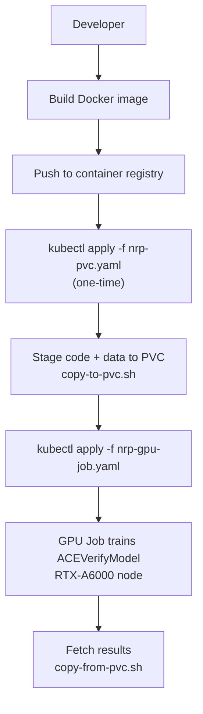
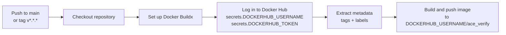

# Setup and Deployment

> :material-docker: Developer and DevOps guide covering local setup, Conda/Docker environments, GPU/CUDA configuration, Kubernetes/NRP deployment, and the GitHub Actions CI/CD pipeline.

---

## Prerequisites

### System Requirements

| Requirement | Minimum | Recommended | Notes |
|---|---|---|---|
| **Python** | 3.10 | 3.11 or 3.12 | Defined in `aceverify/pyproject.toml`: `requires-python = ">=3.10,<3.13"` |
| **CUDA** | 12.0 | 12.4 | Docker image uses CUDA 12.4 (cudnn9) |
| **GPU VRAM** | 8 GiB | 16+ GiB | Training requires more VRAM than inference |
| **Disk Space** | 20 GiB | 50+ GiB | HDF5 datasets + model checkpoints |
| **ffmpeg** | Any recent | Latest | Required for preprocessing |

### GPU Requirements

- **Inference (Web App)**: Works on CPU; GPU improves throughput.
- **Training**: Requires a CUDA-capable GPU. The NRP deployment template targets `NVIDIA-RTX-A6000` GPUs (see `assets/templates/nrp-gpu-job.yaml`).
- **Docker GPU Access**: Use `--gpus all` flag when running the container with NVIDIA Container Toolkit installed.

### FFmpeg Installation

=== "Ubuntu / Debian"

    ```bash
    sudo apt-get update && sudo apt-get install -y ffmpeg
    ```

=== "macOS (Homebrew)"

    ```bash
    brew install ffmpeg
    ```

=== "Conda"

    ```bash
    conda install -c conda-forge ffmpeg
    ```

=== "Windows"

    Download from [ffmpeg.org](https://ffmpeg.org/) and add the `bin` directory to your `PATH`.

Verify installation:

```bash
ffmpeg -version
```

---

## Local Installation

### Option 1: Conda (Recommended)

> **Source**: `conda_env_new.yml`

```bash linenums="1"
# Create the conda environment with Python 3.11 and the full ML stack
conda env create -f conda_env_new.yml

# Activate the environment
conda activate aceverify

# Install the project in editable mode
pip install -e .
```

The `conda_env_new.yml` environment includes:

| Category | Packages |
|---|---|
| Core | `python=3.11`, `ipykernel`, `ipython`, `jupyter_client` |
| ML / DL | `torch`, `torchvision`, `torchaudio` (via pip) |
| CV | `facenet-pytorch`, `opencv-python-headless`, `mediapipe` |
| Data | `h5py`, `numpy`, `scipy`, `scikit-learn`, `matplotlib` |
| Web | `streamlit` |
| Utils | `tqdm`, `pyyaml`, `pydantic`, `requests`, `pillow`, `sqlalchemy`, `dataset`, `alembic` |

### Option 2: Minimal Conda + Pip

> **Source**: `conda_env.yml`

```bash linenums="1"
# Create a minimal conda environment (Python 3.13)
conda env create -f conda_env.yml
conda activate aceverify

# Install PyTorch with CUDA support (adjust for your CUDA version)
pip install torch torchvision torchaudio

# Install the project and all dependencies
pip install -e .
```

### Option 3: Virtual Environment

```bash linenums="1"
python -m venv .venv
source .venv/bin/activate

# Install PyTorch (CUDA 12.4 example)
pip install torch torchvision torchaudio --index-url https://download.pytorch.org/whl/cu124

# Install the project
pip install -e .
```

### Verifying Installation

```bash linenums="1"
# Check CLI entrypoints are installed
aceverify-train --help
aceverify-preprocess --help
aceverify-evaluate --help

# Run the web application
streamlit run frontend/app.py
```

The web application should be available at `http://localhost:8501`.

---

## Docker Deployment

> **Source**: `Dockerfile`

### Dockerfile Overview

| Stage | Details |
|---|---|
| **Base Image** | `pytorch/pytorch:2.5.1-cuda12.4-cudnn9-runtime` |
| **System Dependencies** | `ffmpeg`, `git`, `build-essential`, `libgl1`, `libglib2.0-0` |
| **Python Dependencies** | `numpy`, `h5py`, `timm`, `scikit-learn`, `matplotlib`, `ffmpeg-python`, `facenet-pytorch`, `Pillow`, `scipy`, `streamlit`, `opencv-python-headless`, `mediapipe`, `sqlalchemy`, `dataset`, `alembic`, `torchaudio==2.5.1`, `torchvision==0.20.1` |
| **Copied Files** | `.streamlit/`, `aceverify/`, `evaluation/`, `frontend/`, `models/`, `utilities/`, `README.md`, `README_NRP.md` |
| **Exposed Port** | `8501` |
| **Entry Point** | `streamlit run frontend/app.py --server.address=0.0.0.0 --server.port=8501 --server.enableStaticServing=true` |

### Building the Image

```bash
docker build -t aceverify:latest .
```

### Running the Web Application

```bash
docker run --rm -it \
  --gpus all \
  -p 8501:8501 \
  -v "$PWD":/workspace \
  aceverify:latest
```

| Flag | Purpose |
|---|---|
| `--rm` | Remove container after exit |
| `-it` | Interactive mode with TTY |
| `--gpus all` | Pass all GPUs to container (requires NVIDIA Container Toolkit) |
| `-p 8501:8501` | Map container port 8501 to host |
| `-v "$PWD":/workspace` | Mount current directory as `/workspace` in container |

The web application starts on `http://localhost:8501`. The volume mount allows local edits to be visible inside the container.

### Running Training Inside the Container

```bash
docker run --rm -it \
  --gpus all \
  -v "$PWD":/workspace \
  aceverify:latest \
  aceverify-train \
    --train_path /workspace/data/train_data-003.h5 \
    --test_path /workspace/data/test_data.h5 \
    --checkpoint-path /workspace/results/aceverify_final.pth
```

### Running Evaluation Inside the Container

```bash
docker run --rm -it \
  --gpus all \
  -v "$PWD":/workspace \
  aceverify:latest \
  aceverify-evaluate \
    --h5 /workspace/data/test_data.h5 \
    --checkpoint /workspace/results/aceverify_final.pth
```

### Running Preprocessing Inside the Container

```bash
docker run --rm -it \
  -v "$PWD":/workspace \
  aceverify:latest \
  aceverify-preprocess <zip_file> <subfolder> --output /workspace/data/processed_data.h5
```

!!! note "PYTHONPATH"
    The `PYTHONPATH=/workspace` environment variable (set in the Dockerfile) ensures that the package entrypoints and module imports work correctly inside the container.

---

## Kubernetes / NRP Deployment

> **Sources**: `assets/templates/nrp-pvc.yaml`, `assets/templates/nrp-gpu-job.yaml`, `assets/templates/nrp-sweep-job.yaml`, `README_NRP.md`

### Deployment Architecture



### Step 1: Create Persistent Volume Claim (One-Time)

> **Source**: `assets/templates/nrp-pvc.yaml`

```bash
kubectl apply -f assets/templates/nrp-pvc.yaml
```

```yaml linenums="1" title="assets/templates/nrp-pvc.yaml"
apiVersion: v1
kind: PersistentVolumeClaim
metadata:
  name: aceverify-pvc
spec:
  accessModes:
    - ReadWriteOnce
  resources:
    requests:
      storage: 200Gi
  storageClassName: rook-ceph-block
```

| Setting | Value | Description |
|---|---|---|
| PVC Name | `aceverify-pvc` | Referenced by all job manifests |
| Access Mode | `ReadWriteOnce` | Single-node read/write |
| Storage | `200Gi` | 200 GiB storage capacity |
| Storage Class | `rook-ceph-block` | NRP Ceph block storage |

### Step 2: Stage Code and Data into the PVC

> **Source**: `scripts/copy-to-pvc.sh`

```bash
bash scripts/copy-to-pvc.sh ./ aceverify-pvc /workspace
```

This script:

1. Creates an ephemeral Alpine pod with the PVC mounted at `/workspace`.
2. Copies the local directory contents into the pod's `/workspace` path.
3. Deletes the ephemeral pod.

### Step 3: Build and Push the Container Image

```bash
# Build the image
docker build -t your-registry/aceverify:latest .

# Push to your container registry
docker push your-registry/aceverify:latest
```

Update the `image` field in `assets/templates/nrp-gpu-job.yaml` and `assets/templates/nrp-sweep-job.yaml` to point to your pushed image:

```yaml
image: your-registry/aceverify:latest
```

### Step 4: Launch the Training Job

> **Source**: `assets/templates/nrp-gpu-job.yaml`

```bash
kubectl apply -f assets/templates/nrp-gpu-job.yaml
kubectl wait --for=condition=complete job/aceverify-train --timeout=48h
```

```yaml linenums="1" title="assets/templates/nrp-gpu-job.yaml"
apiVersion: batch/v1
kind: Job
metadata:
  name: aceverify-train
spec:
  template:
    spec:
      restartPolicy: Never
      containers:
        - name: aceverify
          image: your-registry/aceverify:latest
          resources:
            requests:
              cpu: "4"
              memory: "16Gi"
              nvidia.com/gpu: "1"
            limits:
              cpu: "4"
              memory: "16Gi"
              nvidia.com/gpu: "1"
          command: ["python", "-u", "aceverify/train.py",
                    "--train_path", "/workspace/data/train.h5",
                    "--test_path", "/workspace/data/test.h5",
                    "--checkpoint-path",
                    "/workspace/results/aceverify_final.pth"]
          volumeMounts:
            - mountPath: /workspace
              name: workspace
      volumes:
        - name: workspace
          persistentVolumeClaim:
            claimName: aceverify-pvc
      nodeSelector:
        nvidia.com.gpu.product: "NVIDIA-RTX-A6000"
      tolerations:
        - key: "nvidia.com/gpu"
          operator: "Exists"
  backoffLimit: 2
```

| Setting | Value | Description |
|---|---|---|
| Job Name | `aceverify-train` | Kubernetes job identifier |
| CPU Request / Limit | `4` | 4 CPU cores |
| Memory Request / Limit | `16Gi` | 16 GiB RAM |
| GPU Request / Limit | `1` | 1 NVIDIA GPU |
| Node Selector | `NVIDIA-RTX-A6000` | Targets RTX A6000 GPU nodes on NRP |
| GPU Tolerations | `nvidia.com/gpu: Exists` | Allows scheduling on GPU nodes |
| Backoff Limit | `2` | Maximum retry attempts on failure |
| PVC Mount | `/workspace` | Workspace path with code/data/results |

### Step 4 (Alternative): Launch a Hyperparameter Sweep

> **Source**: `assets/templates/nrp-sweep-job.yaml`

```bash
kubectl apply -f assets/templates/nrp-sweep-job.yaml
kubectl wait --for=condition=complete job/aceverify-sweep --timeout=48h
```

```yaml linenums="1" title="assets/templates/nrp-sweep-job.yaml"
apiVersion: batch/v1
kind: Job
metadata:
  name: aceverify-sweep
spec:
  completions: 4
  parallelism: 4
  template:
    spec:
      # ... rest similar to nrp-gpu-job.yaml with --epochs 5 ...
```

| Setting | Value | Description |
|---|---|---|
| Completions | `4` | Run 4 parallel training jobs |
| Parallelism | `4` | Up to 4 jobs running simultaneously |
| Epochs | `5` | Shorter training runs for sweeps |

### Step 5: Fetch Results from the PVC

> **Source**: `scripts/copy-from-pvc.sh`

```bash
bash scripts/copy-from-pvc.sh aceverify-pvc /workspace/results ./out
```

This script:

1. Creates an ephemeral Alpine pod with the PVC mounted at `/workspace`.
2. Copies the `/workspace/results` directory from the pod to the local `./out` directory.
3. Deletes the ephemeral pod.

---

## GitHub Actions CI/CD

> **Source**: `.github/workflows/docker-build.yml`

### Workflow Overview



### Workflow Configuration

| Setting | Value | Description |
|---|---|---|
| **Triggers** | `workflow_dispatch`, push to `main`, tag `v*.*.*`, PR to `main` | Flexible trigger options |
| **Runner** | `ubuntu-latest` | GitHub-hosted runner |
| **Registry** | Docker Hub | Uses `secrets.DOCKERHUB_USERNAME` and `secrets.DOCKERHUB_TOKEN` |
| **Image Name** | `${{ secrets.DOCKERHUB_USERNAME }}/ace_verify` | Configurable via secrets |
| **Build Context** | `.` (repo root) | Full repository as build context |
| **Push Behavior** | Pushes only if not a PR event (`github.event_name != 'pull_request'`) | Prevents PR builds from pushing |
| **Cache** | `type=gha` (GitHub Actions cache) | Speeds up subsequent builds |

### Required Secrets

| Secret Name | Description |
|---|---|
| `DOCKERHUB_USERNAME` | Docker Hub username for image push |
| `DOCKERHUB_TOKEN` | Docker Hub access token for authentication |

### Setting Up Secrets

1. Go to your GitHub repository **Settings**.
2. Navigate to **Secrets and Variables** → **Actions**.
3. Add the required repository secrets:
   - `DOCKERHUB_USERNAME` = your Docker Hub username
   - `DOCKERHUB_TOKEN` = your Docker Hub access token (generate at `hub.docker.com` under **Account Settings** → **Security**)

---

## Environment Variable Reference

### Dockerfile Environment Variables

> **Source**: `Dockerfile:3`

| Variable | Value | Purpose |
|---|---|---|
| `DEBIAN_FRONTEND` | `noninteractive` | Suppress apt-get prompts during image build |
| `PYTHONDONTWRITEBYTECODE` | `1` | Prevent `.pyc` file generation |
| `PYTHONUNBUFFERED` | `1` | Enable unbuffered output for real-time logging |
| `PIP_NO_CACHE_DIR` | `1` | Disable pip cache to reduce image size |
| `PYTHONPATH` | `/workspace` | Enable module imports inside the container |

### Runtime Environment Variables

| Variable | Purpose | Default |
|---|---|---|
| `FFMPEG_BIN` | Override path to ffmpeg executable | Resolved from `PATH` |
| `CUDA_VISIBLE_DEVICES` | Restrict GPU visibility | All GPUs |
| `FFMPEG_BIN` (env) | Fallback for ffmpeg resolution if `--ffmpeg-bin` not provided | `os.environ.get('FFMPEG_BIN')` |

### Streamlit Configuration

> **Source**: `.streamlit/config.toml`

```toml
[server]
enableStaticServing = true
```

This enables Streamlit's static file serving, which is required for:

- Serving preset videos from `frontend/static/` at `app/static/...`
- Serving user uploads from `frontend/static/uploads/` at `app/static/uploads/...`
- Low-latency same-origin video playback in the upload-card media preview

---

## Deployment Checklist

### Local Development

- [ ] Python 3.10+ installed (`python --version`)
- [ ] ffmpeg installed and available on `PATH` (`ffmpeg -version`)
- [ ] Conda environment created (`conda env create -f conda_env_new.yml`)
- [ ] Project installed in editable mode (`pip install -e .`)
- [ ] CLI entrypoints available (`aceverify-train --help`)
- [ ] Web application runs successfully (`streamlit run frontend/app.py`)

### Docker Deployment

- [ ] Docker installed and running
- [ ] NVIDIA Container Toolkit installed (for GPU access)
- [ ] Docker image built successfully (`docker build -t aceverify:latest .`)
- [ ] Container runs with GPU access (`docker run --gpus all ...`)
- [ ] Web application accessible at `http://localhost:8501`

### Kubernetes / NRP Deployment

- [ ] `kubectl` configured with NRP cluster access
- [ ] Persistent Volume Claim created (`kubectl apply -f assets/templates/nrp-pvc.yaml`)
- [ ] Code and data staged to PVC (`bash scripts/copy-to-pvc.sh`)
- [ ] Docker image built and pushed to container registry
- [ ] `image` field updated in `nrp-gpu-job.yaml` and/or `nrp-sweep-job.yaml`
- [ ] Training Job submitted (`kubectl apply -f assets/templates/nrp-gpu-job.yaml`)
- [ ] Job completion verified (`kubectl wait --for=condition=complete job/aceverify-train`)
- [ ] Results fetched from PVC (`bash scripts/copy-from-pvc.sh`)

### GitHub Actions CI/CD

- [ ] `DOCKERHUB_USERNAME` secret added to repository
- [ ] `DOCKERHUB_TOKEN` secret added to repository
- [ ] Workflow triggers correctly on push to `main` or tag `v*.*.*`
- [ ] Image successfully pushed to Docker Hub
