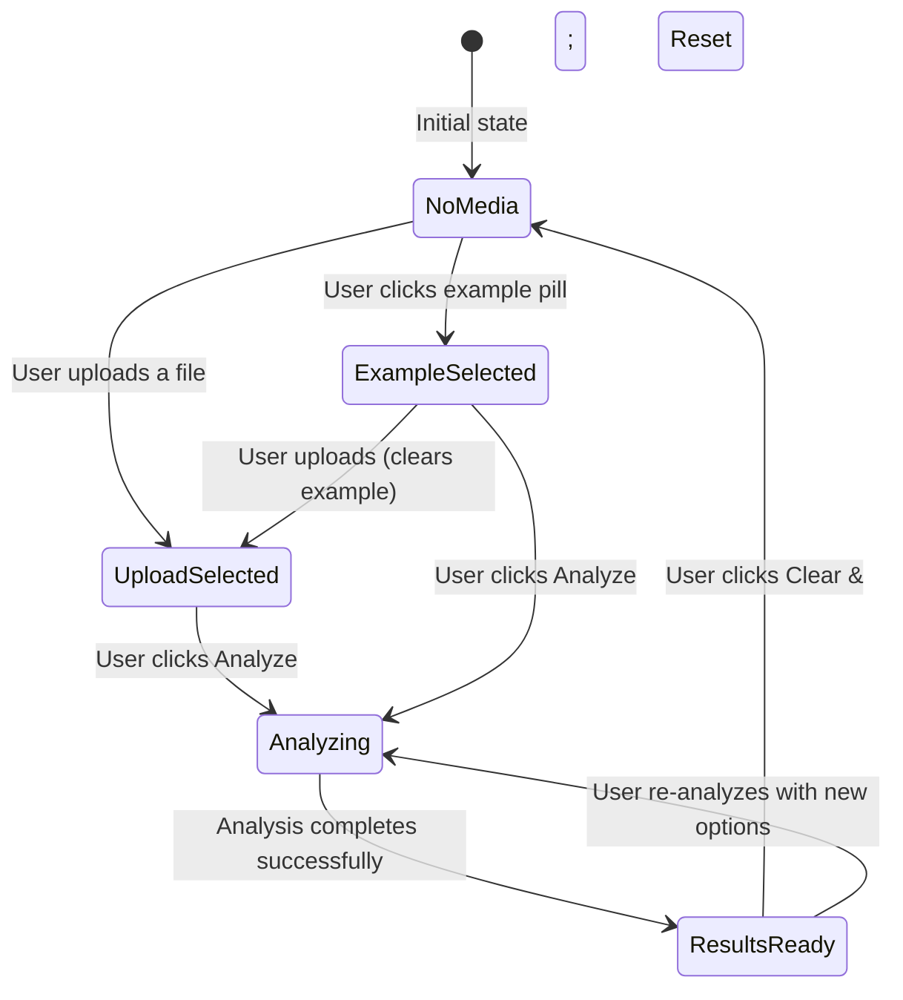

# UI and Frontend Components

> :material-monitor-dashboard: Full documentation of the ACE.verify web interface architecture, component hierarchy, responsive layout guidelines, progress bar/state management, and custom CSS design system.

---

## Technology Stack

| Component | Technology | Version / Details |
|---|---|---|
| Framework | Streamlit | Web app framework, port 8501 |
| Styling | CSS3 | Custom CSS injected via `st.markdown(unsafe_allow_html=True)` |
| Fonts | Google Fonts | DM Sans, DM Mono, Instrument Serif |
| State | `st.session_state` | Persists state across Streamlit reruns |
| Static Serving | `server.enableStaticServing` | Set to `true` in `.streamlit/config.toml` |

---

## Application Entry Point

> **Source**: `frontend/app.py:1`

The application entry point performs three critical setup steps:

```python linenums="1" title="frontend/app.py"
# 1. Resolve the repository root directory
current_file_path = pathlib.Path(__file__).resolve()
root_dir = str(current_file_path.parent.parent)
if root_dir not in sys.path:
    sys.path.insert(0, root_dir)

# 2. Import local packages (models, utilities)
import models
import utilities

# 3. Patch Streamlit's static video MIME types
utilities.ensure_static_video_mime()
```

The `root_dir` is used throughout the application to locate static assets, save user uploads, and resolve file paths.

---

## Component Hierarchy

```mermaid
flowchart TD
    APP["frontend/app.py"] --> NAV["Navbar<br/>(st.markdown)"]
    APP --> HERO["Hero Section<br/>(st.markdown)"]
    APP --> UPLOAD["Upload Card Container"]
    APP --> RESULTS["Results Section<br/>(conditional)"]
    APP --> FOOTER["Footer<br/>(st.markdown)"]

    UPLOAD --> UC_LEFT["Left Column (45%)<br/>Upload Controls"]
    UPLOAD --> UC_RIGHT["Right Column (55%)<br/>Media Preview"]

    UC_LEFT --> UPLOADER["File Uploader<br/>st.file_uploader"]
    UC_LEFT --> EXAMPLES["Example Media Pills<br/>5 preset videos"]
    UC_LEFT --> MODEL_SEL["Model Selectbox<br/>EfficientNet-B4 / XceptionNet<br/>ACE.verify"]
    UC_LEFT --> THRESHOLD["Confidence Threshold Slider<br/>0.0 – 1.0, default 0.5"]
    UC_LEFT --> OPTIONS["Options Checkboxes<br/>Show Grad-CAM / Face landmarks"]
    UC_LEFT --> ANALYZE_BTN["Analyze Button<br/>triggers detection"]

    UC_RIGHT --> MEDIA_PREVIEW["render_media_preview()<br/>utilities/media_preview.py"]

    RESULTS --> VERDICT["Verdict Banner<br/>verdict-fake / verdict-real"]
    RESULTS --> HEATMAP["Grad-CAM Heatmap Card<br/>st.image(heatmap_img)"]
    RESULTS --> GAUGE["Confidence Gauge Card<br/>fake probability %"]
    RESULTS --> EVIDENCE["Evidence Flags Card<br/>chip grid (red/amber/green)"]
    RESULTS --> METADATA["Metadata Card<br/>file info table"]
    RESULTS --> TIMELINE["Temporal Fakeness Timeline<br/>render_timeline_html()"]
    RESULTS --> FRAME_INSP["Frame Inspector Card<br/>slider + Grad-CAM thumbnail"]
    RESULTS --> ACTIONS["Action Row<br/>Export PDF / Copy JSON<br/>Share / Clear & Reset"]
```



---

## Session State Management

> **Source**: `frontend/app.py:29`

The application uses `st.session_state` to manage state across Streamlit reruns (which occur on every user interaction).

### Initial State

```python linenums="1" title="frontend/app.py"
if "analyzed" not in st.session_state:
    st.session_state.results = {}          # Detection results dict
    st.session_state.analyzed = False      # Whether analysis has been run

if "file_ext" not in st.session_state:
    st.session_state.file_ext = None       # Current file extension
    st.session_state.example_file = None   # Selected example media
    st.session_state.active_file_path = None
    st.session_state.active_file_name = None
    st.session_state.active_static_url = None
    st.session_state.upload_sig = None     # (name, size) of current upload
    st.session_state.upload_disk_path = None
```

### State Variables

| Variable | Type | Purpose |
|---|---|---|
| `results` | `dict` | All detection outputs (model, fake_prob, heatmap_img, evidence_flags, regions, metadata, timeline_scores, media, duration_in_sec) |
| `analyzed` | `bool` | Flag indicating whether analysis has been completed |
| `file_ext` | `str \| None` | Extension of the current media file |
| `example_file` | `dict \| None` | Selected example media metadata |
| `active_file_path` | `str \| None` | Absolute path of the currently selected media |
| `active_file_name` | `str \| None` | Display name of the currently selected media |
| `active_static_url` | `str \| None` | Streamlit static URL for preview playback |
| `upload_sig` | `tuple \| None` | `(name, size)` signature of the current upload |
| `upload_disk_path` | `str \| None` | Filesystem path under `frontend/static/uploads/` |

### State Transitions



### Cleanup Functions

- **`cleanup_upload_disk()`** (`app.py:66`): Removes a previously saved user upload from `frontend/static/uploads/` and clears the `upload_disk_path` and `active_static_url` state variables.
- **`clear_media_selection()`** (`app.py:72`): Full reset of all media-selection state, including cleaning up the upload disk file, clearing results, and resetting all file-related state variables.

---

## Page Layout & Responsive Design

> **Sources**: `frontend/app.py:21`, `frontend/app.css`

### Page Configuration

```python linenums="1" title="frontend/app.py"
st.set_page_config(
    page_title="ACE.verify - Deepfake Detector",
    page_icon="☑️",
    layout="wide",
    initial_sidebar_state="collapsed",
)
```

### Container Width

```css
.block-container {
    padding: 0 2rem 2rem 2rem;
    max-width: 1200px;
    margin: auto;
}
```

The main content area is constrained to a maximum width of 1200px and centered, with horizontal padding of 2rem.

### Upload Card: Two-Column Split

The upload card uses a `45:55` column ratio:

```python
col_left, col_right = st.columns([45, 55], gap="medium")
```

```css
/* Left column (controls): 45% width */
div[data-testid="stHorizontalBlock"] > div[data-testid="stColumn"]:has(.upload-left-anchor) {
    flex: 45 1 0% !important;
    max-width: 45% !important;
}

/* Right column (preview): 55% width */
div[data-testid="stHorizontalBlock"] > div[data-testid="stColumn"]:has(.upload-right-anchor) {
    flex: 55 1 0% !important;
    max-width: 55% !important;
}
```

### Responsive Breakpoint

```css
@media (max-width: 900px) {
    div[data-testid="stHorizontalBlock"] > div[data-testid="stColumn"]:has(.upload-left-anchor),
    div[data-testid="stHorizontalBlock"] > div[data-testid="stColumn"]:has(.upload-right-anchor) {
        flex: 1 1 100% !important;
        max-width: 100% !important;
    }
}
```

Below 900px viewport width, the two-column layout collapses into a single stacked column.

### Preview Pane Height

```python
PREVIEW_PANE_HEIGHT = 570  # px — right pane matches the stacked left column
```

The media preview pane is pinned to a fixed height of 570px to match the height of the stacked left column controls.

---

## Custom CSS Design System

> **Source**: `frontend/app.css`

### CSS Variables (Design Tokens)

```css linenums="1" title="frontend/app.css"
:root {
    --cream:      #F5F0E8;   /* Primary background */
    --cream-dark: #EDE8DC;   /* Card background */
    --ink:        #1A1A1A;   /* Primary text */
    --ink-soft:   #4A4A4A;   /* Secondary text */
    --amber:      #F0A030;   /* Accent / buttons */
    --amber-dark: #D4891A;   /* Button hover */
    --red:        #E84040;   /* Fake verdict / high risk */
    --green:      #2ECC71;   /* Authentic verdict / low risk */
    --green-soft: #27AE60;   /* Evidence chip green */
    --yellow:     #F5C518;   /* Uncertain verdict */
    --card-bg:    #EDE8DC;   /* Analysis card background */
    --border:     #C8BFA8;   /* Border color */
    --mono:       'DM Mono', monospace;
}
```

### Typography

| Element | Font | Usage |
|---|---|---|
| Body text | DM Sans | Primary UI text |
| Monospace | DM Mono | Section labels, metadata, tooltips, timeline ticks |
| Headlines (hero) | Instrument Serif | Large display text |
| Verdict stamp | Instrument Serif | Verdict banner text |
| Gauge value | Instrument Serif | Confidence percentage |

### Card System

The CSS defines an anchored selector pattern for targeting Streamlit's internal DOM structure. Zero-height hidden anchor divs (e.g., `upload-card-anchor`, `analysis-card-anchor`) are injected via `st.markdown()` and used in `:has()` selectors:

```css linenums="1" title="frontend/app.css"
/* Upload card */
div[data-testid="stVerticalBlock"]:has(> div > div > div > div > .upload-card-anchor) {
    background-color: var(--card-bg) !important;
    border: 2px solid var(--border) !important;
    border-radius: 16px !important;
    box-shadow: 5px 5px 0px var(--ink) !important;
}

/* Analysis cards */
div[data-testid="stVerticalBlock"]:has(> div > div > div > div > .analysis-card-anchor) {
    background: var(--card-bg) !important;
    border: 2px solid var(--border) !important;
    border-radius: 12px !important;
    box-shadow: 3px 3px 0px var(--ink) !important;
}
```

!!! tip "Neo-brutalist design"
    The design system uses a **neo-brutalist** aesthetic with hard-edged drop shadows (`box-shadow: Npx Npx 0px var(--ink)`), thick borders (2px), and rounded corners (12&ndash;16px).

---

## Navbar Component

> **Source**: `frontend/app.py:96`

```html
<div class="navbar">
  <div class="navbar-brand">ACE<span>.verify</span></div>
  <span class="sparkle">✦</span>
  <div class="navbar-links">
    <span class="nav-badge">BETA</span>
    <span class="nav-link">v1.0</span>
    <span class="nav-link">
      <a href="https://github.com/AB-at-UCR/ACE.verify" target="_blank">
        GitHub
      </a>
    </span>
    <span class="nav-link">Docs</span>
  </div>
</div>
```

### Navbar Styling

| Element | Style |
|---|---|
| Container | Flexbox, `justify-content: space-between`, 2px bottom border in `--ink` |
| Brand | DM Sans, 700 weight, 1.4rem, `.verify` in `--amber` |
| BETA badge | Red background, white text, uppercase, 0.6rem |
| Nav links | DM Mono, 0.85rem, `--ink-soft` |

---

## Hero Section

> **Source**: `frontend/app.py:110`

```html
<div class="hero">
  <h1>AI-powered<br><em>deepfake detector</em></h1>
  <center><p class="hero-sub">
    Upload a video or image. Our model analyzes facial regions, flags anomalies,
    and pinpoints exactly <em>where</em> and <em>when</em> manipulation occurs.
  </p></center>
</div>
```

### Hero Styling

| Element | Style |
|---|---|
| Container | Center-aligned, padding `0 0 2.5rem`, positioned above upload card |
| Headline | Instrument Serif, `clamp(2.8rem, 6vw, 4.5rem)`, weight 400, `--ink` |
| Headline `<em>` | Italic, `--amber-dark` color |
| Subtitle | DM Sans, 1.05rem, `--ink-soft`, max-width 1040px |

---

## Upload Card

> **Source**: `frontend/app.py:120`

The upload card is the primary interaction surface, containing media upload controls, example media selection, model configuration, and analysis options.

### Layout Structure

```
┌─────────────────────────────────────────────────────────┐
│  Upload Card (max-width: 1080px, box-shadow: 5px 5px)    │
│  ┌──────────────────┐  ┌────────────────────────────┐   │
│  │ LEFT COLUMN (45%)│  │ RIGHT COLUMN (55%)         │   │
│  │                  │  │                            │   │
│  │ Upload media     │  │ Media preview              │   │
│  │ [File uploader]  │  │ ┌────────────────────────┐ │   │
│  │                  │  │ │  Video/Image Preview   │ │   │
│  │ Try example media│  │ │  (height: 570px)       │ │   │
│  │ [pill][pill]     │  │ │                        │ │   │
│  │ [pill][pill]     │  │ └────────────────────────┘ │   │
│  │ [pill]           │  │                            │   │
│  │                  │  │                            │   │
│  │ Detection model  │  │                            │   │
│  │ [Selectbox]      │  │                            │   │
│  │                  │  │                            │   │
│  │ Confidence   Opt │  │                            │   │
│  │ [Slider] [✓][✓]  │  │                            │   │
│  │                  │  │                            │   │
│  │ [Analyze ✦]      │  │                            │   │
│  └──────────────────┘  └────────────────────────────┘   │
└─────────────────────────────────────────────────────────┘
```

### File Uploader

```python linenums="1" title="frontend/app.py"
uploaded_file = st.file_uploader(
    "Drop video or image here",
    type=["mp4", "mov", "avi", "jpg", "jpeg", "png"],
    label_visibility="collapsed"
)
```

### Example Media Pills

Five preset deepfake samples are rendered as button-based pills in rows of 3:

| Label | Filename | Description |
|---|---|---|
| FaceSwap clip | `faceswap_clip.mp4` | Face-swapped video |
| Lip-sync fake | `lip-sync_fake.mp4` | Lip-sync manipulation |
| GAN portrait | `gan_portrait.mp4` | GAN-generated portrait |
| Unauthentic news | `unauthentic_news.mp4` | Fabricated news footage |
| Political speech | `political_speech.mp4` | Manipulated political speech |

```python
example_media = {
    "FaceSwap clip": "faceswap_clip.mp4",
    "Lip-sync fake": "lip-sync_fake.mp4",
    "GAN portrait": "gan_portrait.mp4",
    "Unauthentic news": "unauthentic_news.mp4",
    "Political speech": "political_speech.mp4",
}
```

### Model Selection

```python
model_choice = st.selectbox(
    "Model",
    ["EfficientNet-B4 (Fast)", "XceptionNet (Accurate)", "ACE.verify (Best)"],
    label_visibility="collapsed"
)
```

### Confidence Threshold & Options

```python linenums="1" title="frontend/app.py"
col_thr, col_opt = st.columns(2, gap="small")

with col_thr:
    threshold = st.slider("Threshold", 0.0, 1.0, 0.5, 0.01)

with col_opt:
    show_heatmap   = st.checkbox("Show Grad-CAM", value=True)
    show_landmarks = st.checkbox("Face landmarks", value=False)
```

### Upload State Management

When a user uploads a file, the application:

1. Clears any selected example media.
2. Checks if the upload signature `(name, size)` differs from the previously stored upload.
3. If changed, cleans up any existing upload on disk via `cleanup_upload_disk()`.
4. Saves the upload bytes to `frontend/static/uploads/` via `utilities.save_upload_bytes()`.
5. Computes the file extension and static URL for preview.
6. Stores all metadata in `st.session_state`.

```python linenums="1" title="frontend/app.py"
if uploaded_file:
    st.session_state.example_file = None
    upload_sig = (uploaded_file.name, uploaded_file.size)
    if st.session_state.get("upload_sig") != upload_sig \
       or not st.session_state.active_file_path:
        cleanup_upload_disk()
        path, display_name, static_url = utilities.save_upload_bytes(
            uploaded_file.getvalue(), uploaded_file.name, root_dir,
        )
        # ... store in session state ...
```

---

## Media Preview

> **Source**: `utilities/media_preview.py`

The `render_media_preview()` function renders a compact media preview inside the upload card's right column. It is rendered inside an HTML iframe for complete styling control.

### Preview States

| State | Display |
|---|---|
| No media selected | Dashed placeholder with film icon: "No media selected" |
| File too large (>80 MB) | Notice: "File too large for inline preview &mdash; analysis still works" |
| Video file (`.mp4`, `.mov`, `.avi`) | Custom video player with play/pause, mute, and seek controls |
| Image file (`.jpg`, `.jpeg`, `.png`) | Full-width image preview |

### Video Preview Controls

The video player includes custom HTML5 controls:

```html
<div class="pv-controls">
    <button id="pv-play" class="pv-btn" title="Play / pause">&#9654;</button>
    <button id="pv-mute" class="pv-btn" title="Mute / unmute">&#128266;</button>
    <input id="pv-seek" class="pv-seek" type="range" min="0" max="100" step="0.05" value="0">
    <span id="pv-time" class="pv-time">0:00 / 0:00</span>
</div>
```

JavaScript handles play/pause, seek, mute/unmute, and time display updates. Blob URL revocation is managed on `pagehide` and `beforeunload` events.

### Static URL Resolution

```python
@st.cache_data(max_entries=6, show_spinner=False)
def _encode_file(path, mtime, size):
    with open(path, "rb") as f:
        return base64.b64encode(f.read()).decode("ascii")
```

The preview prioritizes Streamlit's static route (`app/static/...`) for low-latency same-origin playback. If static serving is disabled or the file is not addressable via static URL, it falls back to base64-encoded blob URLs (capped at 80 MB).

---

## Results Section

> **Source**: `frontend/app.py:352`

The results section is conditionally rendered when `st.session_state.analyzed` is `True` and `st.session_state.results` is non-empty.

### Verdict Banner

```python
verdict = "LIKELY FAKE" if is_fake else "LIKELY AUTHENTIC"
verdict_class = "verdict-fake" if is_fake else "verdict-real"
```

| State | CSS Class | Background | Icon |
|---|---|---|---|
| Fake | `.verdict-fake` | `--red` (#E84040) | :material-alert: |
| Authentic | `.verdict-real` | `--green` (#2ECC71) | :material-check-circle: |

The banner displays the verdict text (Instrument Serif, 2rem), a detail subtitle, and the fake probability percentage.

### Grad-CAM Heatmap Card

```python
if show_heatmap_r:
    heatmap_img = r["heatmap_img"]
    st.image(heatmap_img, width='stretch', caption="Red = high probability")
else:
    st.info("Enable Grad-CAM in options.")
```

If the "Face landmarks" checkbox is enabled, additional landmark statistics are displayed:

```html
◆ 68 landmarks detected · Jaw deviation: <b>+4.2°</b> · Eye symmetry: <b>0.71</b>
```

### Confidence Gauge Card

The confidence gauge displays the fake probability as a large percentage with a gradient progress bar:

```html
<div class="gauge-container">
    <div class="gauge-value" style="color:{fill_color}">{fake_prob*100:.0f}%</div>
    <div class="gauge-label">Fake Probability</div>
    <div class="gauge-bar-bg">
      <div class="gauge-bar-fill"
           style="width:{fake_prob*100:.0f}%;background:{fill_color}">
      </div>
    </div>
</div>
```

Below the gauge, per-region scores are displayed as mini progress bars with color coding (red > 60%, green < 60%).

### Evidence Flags Card

Evidence flags are rendered as colored chips:

```html
<div class="chip-grid">
    <span class="chip chip-green">✓ Eye-blink anomaly · 12%</span>
    <span class="chip chip-amber">◆ Lip-sync mismatch · 45%</span>
    <span class="chip chip-red">⚠ Texture inconsistency · 78%</span>
    ...
</div>
```

| Chip Class | Score Range | Color |
|---|---|---|
| `.chip-green` | < 35% | #E6F9F0 bg, #27AE60 text |
| `.chip-amber` | 35%&ndash;60% | #FFF3DC bg, #D4891A text |
| `.chip-red` | > 60% | #FFE8E8 bg, #E84040 text |

### Metadata Card

```html
<table class="meta-table">
    <tbody>
        <tr><td>RESOLUTION</td><td><b>1920 x 1080</b></td></tr>
        <tr><td>DURATION</td><td><b>30.15s</b></td></tr>
        <tr><td>FPS</td><td><b>30.00</b></td></tr>
        <tr><td>CODEC</td><td><b>H264</b></td></tr>
        <tr><td>FACES FOUND</td><td><b>1</b></td></tr>
        <tr><td>MODEL USED</td><td><b>ACE.verify</b></td></tr>
        <tr><td>FILE SIZE</td><td><b>4029.1 KB</b></td></tr>
    </tbody>
</table>
```

The metadata table displays up to 7 key-value pairs from the extracted media metadata and detection configuration.

### Temporal Fakeness Timeline

```python
st.markdown(render_timeline_html(timeline_scores, duration_in_sec), unsafe_allow_html=True)
```

The timeline is rendered as an HTML bar chart with 56 segments (or `timeline_scores` length), each color-coded by score and displaying time/score tooltips on hover.

### Action Row

Four action buttons are rendered in a row:

```python linenums="1" title="frontend/app.py"
act1, act2, act3, act4 = st.columns(4, gap="small")
with act1: st.button("⬇ Export PDF Report", key="btn_pdf")
with act2: st.button("📋 Copy JSON Results", key="btn_json")
with act3: st.button("🔗 Share Analysis Link", key="btn_share")
with act4:
    if st.button("🗑 Clear & Reset", key="btn_reset"):
        clear_media_selection()
        st.rerun()
```

---

## Frame Inspector

> **Source**: `frontend/app.py:469`

The frame inspector allows users to scrub through video frames and view per-frame Grad-CAM overlays:

```python linenums="1" title="frontend/app.py"
frame_col, slider_col = st.columns([1, 3], gap="large",
                                    vertical_alignment="center")

with slider_col:
    frame_idx = st.slider("Frame", 0, int(duration_in_sec * 30 - 1), 45)
    frame_sec = frame_idx / 30
    frame_score = float(np.interp(
        frame_sec,
        np.linspace(0, duration_in_sec, len(timeline_scores)),
        timeline_scores
    ))

with frame_col:
    mapped_idx = int(np.interp(
        frame_idx,
        [0, max(1, int(duration_in_sec * 30) - 1)],
        [0, total_avail - 1]
    ))
    grad_input = media[mapped_idx:mapped_idx+1]
    thumbnail = generate_gradcam(model=model, input_tensor=grad_input.clone(),
                                  intensity=0.85)
    st.image(thumbnail, width='stretch')
```

The slider range spans from 0 to `duration_in_sec × 30` (assuming 30 FPS). The frame score is interpolated from the timeline scores at the selected time position. A new Grad-CAM overlay is generated for the selected frame on each slider change.

---

## Footer

> **Source**: `frontend/app.py:527`

```html
<div class="footer">
  ACE.verify · Powered by AI · Results are probabilistic and for research use only<br>
  <span style="opacity:0.5">✦ &nbsp; Not a substitute for expert forensic analysis</span>
</div>
```

The footer includes a disclaimer noting that results are probabilistic and for research purposes only, and not a substitute for expert forensic analysis.

---

## MIME Patching for Static Video Serving

> **Source**: `utilities/static_media.py:22`

!!! warning "Streamlit ≤ 1.50 MIME bug"
    Streamlit versions ≤ 1.50 force non-allowlisted file extensions (including `.mp4`) to `Content-Type: text/plain` with `X-Content-Type-Options: nosniff`, which prevents `<video>` playback.

The `ensure_static_video_mime()` function patches this:

```python linenums="1" title="utilities/static_media.py"
def ensure_static_video_mime() -> None:
    global _MIME_PATCHED
    if _MIME_PATCHED:
        return
    mimetypes.add_type("video/mp4", ".mp4")
    mimetypes.add_type("video/quicktime", ".mov")
    mimetypes.add_type("video/x-msvideo", ".avi")
    mimetypes.add_type("video/webm", ".webm")
    try:
        from streamlit.web.server import app_static_file_handler as handler
        current = tuple(handler.SAFE_APP_STATIC_FILE_EXTENSIONS)
        missing = tuple(ext for ext in _VIDEO_STATIC_EXTS if ext not in current)
        if missing:
            handler.SAFE_APP_STATIC_FILE_EXTENSIONS = current + missing
    except Exception:
        pass
    _MIME_PATCHED = True
```

This function:

1. Registers MIME types for video extensions via `mimetypes.add_type()`.
2. Extends Streamlit's internal `SAFE_APP_STATIC_FILE_EXTENSIONS` allowlist to include video extensions.
3. Uses a `_MIME_PATCHED` guard to ensure the patch only runs once.
4. Gracefully handles older/newer Streamlit layouts where the symbol may not exist.
